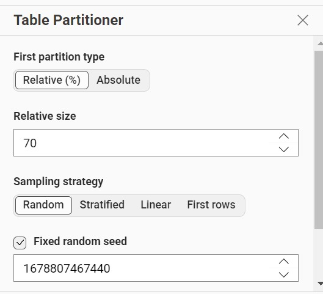
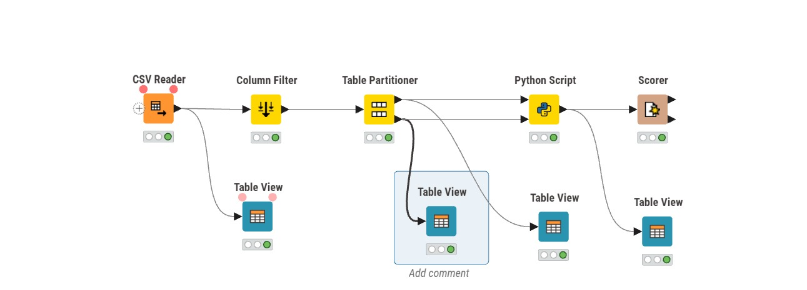
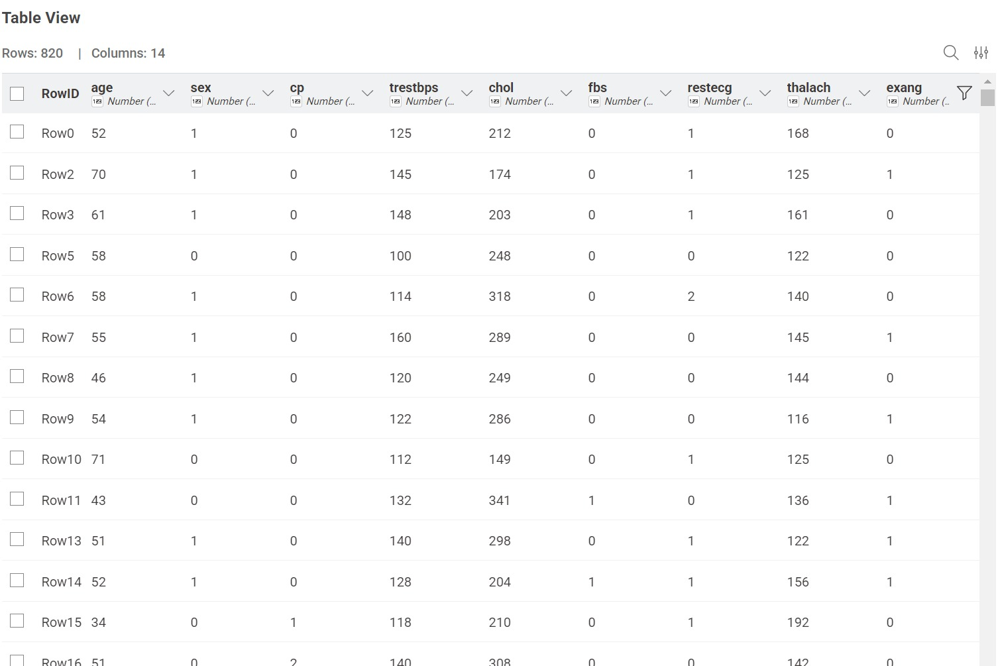
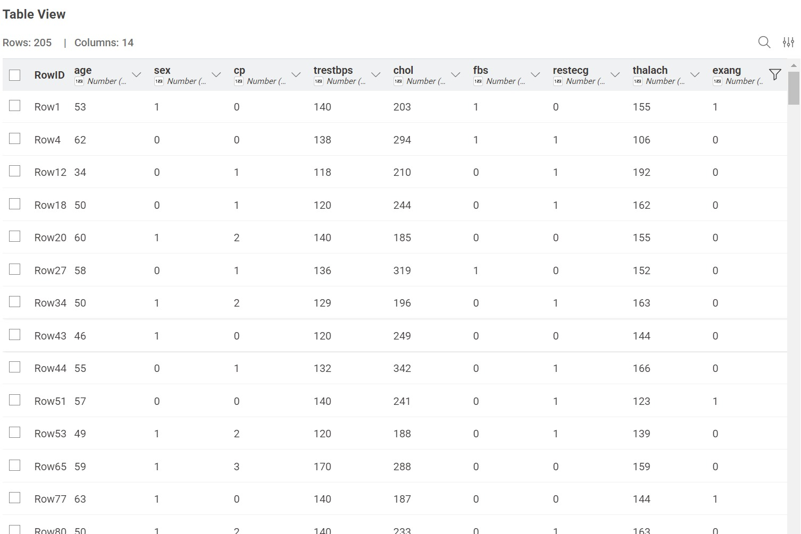
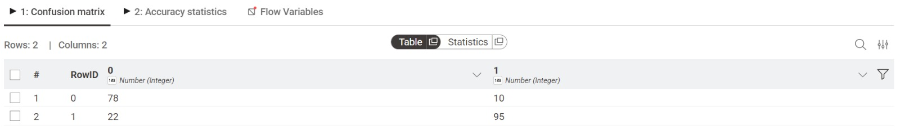
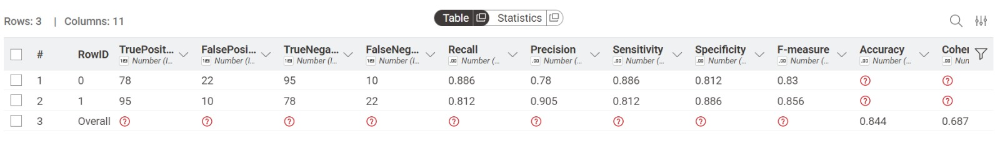

---
jupytext:
  formats: md:myst
  text_representation:
    extension: .md
    format_name: myst
    format_version: 0.13
    jupytext_version: 1.11.5
kernelspec:
  display_name: Python 3
  language: python
  name: python3
---
# Naive Baiyes
## Pengertian
Naïve Bayes adalah algoritma machine learning terawasi (supervised learning) untuk klasifikasi yang berbasis pada Teorema Bayes. Algoritma ini menghitung probabilitas sekumpulan fitur untuk memprediksi kategori/kelas suatu data. Disebut "naïve" karena mengasumsikan semua fitur independen (tidak saling mempengaruhi) terhadap kelas, meski pada kenyataannya seringkali berkorelasi.

## Dataset
Dataset kali ini saya menggunakan dataset heart disease dataset 14 Column
[Heart Disease Dataset](https://www.kaggle.com/datasets/abdullahichowdhury/heart-disease-dataset) Dataset Heart Disesas merupakan dataset yang kategorikal, maka pada preprocessing tahap normalisasi yang dilakukan menggunakan encoding. Pada analisis data menggunakan Naive Bayes ini, terdapat dua jenis teknik encoding utama yang diterapkan untuk mengubah data teks (kategorikal) menjadi format numerik.

| Atribut | Tipe data | Keterangan |
| :--- | :----: | ---: |
| Age | Numerik | Usia pasien |
| Sex | Numerik | Jenis |
| CP | Kategorikal | Tipe Nyeri dada |
| trestbps | Numerik | Gula darah puasa |
| Restcg| Numerik | Tekanan darah istirahat (mm Hg) |
| Cholesterol | Numerik | Kolesterol serum (mm/dl) |
| thalach | Numerik | Detak jantung maksimum yang dicapai (60-202) |
| Exang | Kategorical| Angin akibat olahraga (Y: Ya, N: Tidak) |
| Oldpeak | Numerik | Depresi ST akibat olahraga relatif terhadap saat istirahat |
| Slope | Kategorikal | Kemiringan segmen ST puncak (Up, Flat, Down) |
| ca | Numerik |Jumlah pembuluh darah utama (0-3) diwarnai fluoroskopi |
| thal | kategorikal |Status Thalassemia (normal, cacat tetap, cacat reversibel) |
| target | kategorikal |Diagnosis penyakit jantung (1 = Sakit, 0 = Sehat) |


## Data Partipation
Setelah data melalui tahap normalisasi (encoding), langkah selanjutnya adalah membagi dataset menjadi dua bagian utama menggunakan rasio 80:20. Pembagian ini bertujuan untuk menyediakan data yang cukup untuk belajar, namun tetap menyisakan porsi yang adil untuk pengujian objektif. Pada pembagian partisi ini dibagi menjadi :

- 80% Data Training: Dipakai digunakan untuk belajar model Naive Bayes. Jadi dari data ini, model belajar pola hubungan antara fitur (Outlook, Temperature, dll.) dengan hasil akhirnya (Play)

- 20% Data Testing: Dipakai buat ngetes model. Data ini tidak ikut dipakai saat belajar, jadi bisa lihat seberapa bagus model memprediksi data baru.



## Implementasi K-NIME with
Implementasi dilakukan menggunakan tools KNIME dengan memanfaatkan library scikit-learn untuk perhitungan metode Naive Bayes.

Berikut adalah implementasi alur kerja pada KNIME. Pada nodes Python Script dikonfigurasi dengan dua input port untuk memisahkan data training dan data testing:

Port 1 (Atas): Menerima 80% data (820 baris) untuk proses Training.


Port 2 (Bawah): Menerima 20% data (205 baris) untuk proses Testing.


```{code-cell} 
:tags: [skip-execution]
import knime.scripting.io as knio
from sklearn.naive_bayes import GaussianNB


# 1. Mengambil Data Training dari Port Atas (80%)
df_train = knio.input_tables[0].to_pandas()

# 2. Mengambil Data Testing dari Port Bawah (20%)
df_test = knio.input_tables[1].to_pandas()

# 3. Memisahkan Fitur (X) dan Target (y) pada Data Training
# Mengambil semua kolom kecuali kolom terakhir sebagai fitur
X_train = df_train.iloc[:, :-1].values
# Mengambil kolom paling terakhir (class) sebagai target
y_train = df_train.iloc[:, -1].values

# 4. Memisahkan Fitur pada Data Testing
X_test = df_test.iloc[:, :-1].values

# 5. Inisialisasi dan Pelatihan Model Gaussian Naive Bayes
# Cocok untuk data dengan distribusi normal (numerik)
model = GaussianNB()
model.fit(X_train, y_train)

# 6. Melakukan Prediksi terhadap data testing
predictions = model.predict(X_test)

# 7. Menempelkan hasil prediksi ke tabel testing
df_test['Prediction'] = predictions

# 8. Meneruskan hasil ke workflow KNIME
knio.output_tables[0] = knio.Table.from_pandas(df_test)
```

## Hasil Prediksi dan Evaluasi Model
Setelah dirunning mendapatkan hasil sebagai berikut:

Lalu untuk accuracy sebagai berikut:

