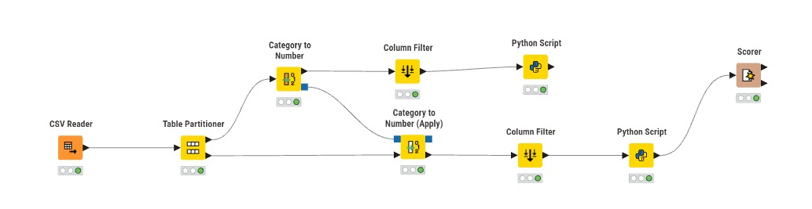
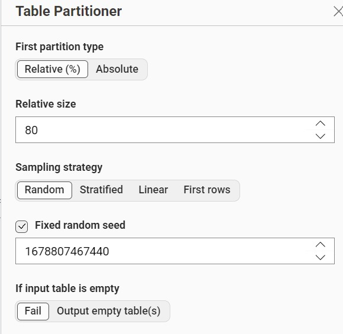
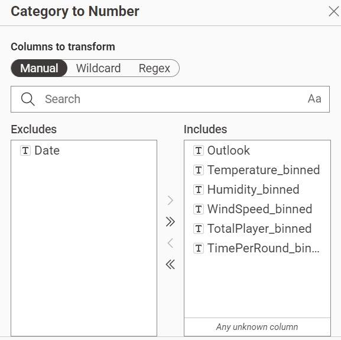
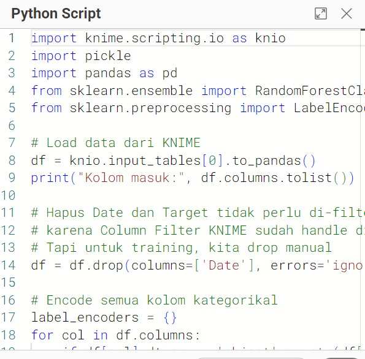
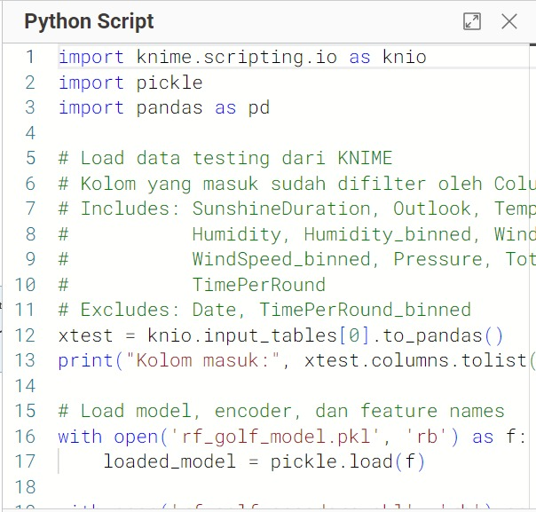
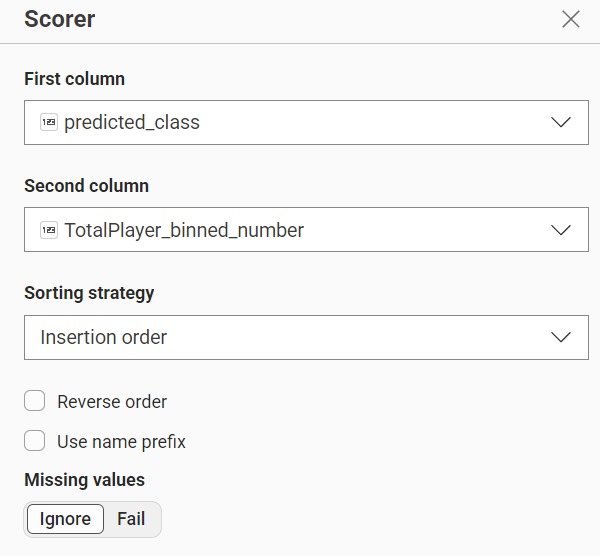
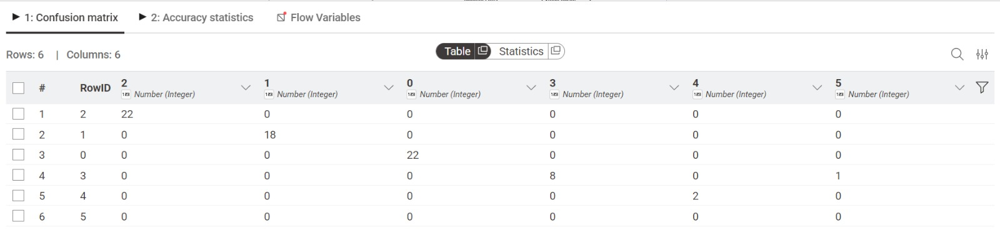
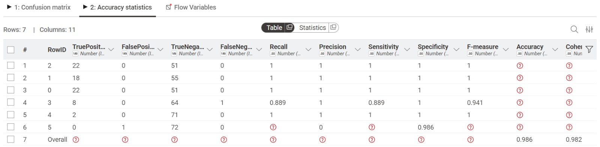

---
jupytext:
  formats: md:myst
  text_representation:
    extension: .md
    format_name: myst
    format_version: 0.13
    jupytext_version: 1.11.5
kernelspec:
  display_name: Python 3
  language: python
  name: python3
---
# Random Forest
## Pengertian
random forest adalah algoritma yang menggabungkan hasil (output) dari beberapa decision tree untuk mencapai satu hasil yang lebih akurat. Random forest membutuhkan gabungan beberapa decision tree untuk memprediksi hasil yang akurat. 

Konsep sederhana dari random forest adalah beberapa decision tree yang tidak berkorelasi akan bekerja lebih baik sebagai kelompok dibandingkan individu. 

Saat menggunakan random forest sebagai pengklasifikasi, satu decision tree menyumbang satu suara. Setiap decision tree bisa menghasilkan jawaban yang sama atau berbeda satu sama lain. Misalnya decision tree A, B, E dan F memprediksi hasil 1. Sementara decision tree C dan D memprediksi hasil 0.

Karena ada banyaknya alternatif jawaban dalam decision tree dan kemungkinan bias yang tinggi, random forest mengambil prediksi hasil dari beberapa decision tree berdasarkan suara mayoritas dan memprediksi hasil yang lebih akur.
## Dataset 
Dataset kali ini saya menggunakan Golf Play Dataset Extended. Golf Play Dataset merupakan dataset yang kategorikal, maka pada preprocessing tidak dilakukan normalisasi maupun encoding karena algoritma Decision Tree dapat langsung menangani data kategorikal tanpa perlu diubah ke format numerik.

| Atribut | Tipe Data | Keterangan |
| :--- | :----: | ---: |
| Date | Numerik | Tanggal observasi |
| SunshineDuration | Numerik | Durasi sinar matahari (jam) |
| Outlook | Kategorikal | Kondisi cuaca (sunny, overcast, rainy) |
| Temperature | Numerik | Suhu udara (°C) |
| Temperature_binned | Kategorikal | Kategori suhu (Cool, Moderate, Warm, Hot) |
| Humidity | Numerik | Kelembaban udara (%) |
| Humidity_binned | Kategorikal | Kategori kelembaban (Dry, Moderate, Humid, Very Humid) |
| WindDirection | Numerik | Arah angin (derajat) |
| WindSpeed | Numerik | Kecepatan angin (m/s) |
| WindSpeed_binned | Kategorikal | Kategori kecepatan angin (No Wind, Very Light Air, dst.) |
| Pressure | Numerik | Tekanan udara (hPa) |
| TotalPlayer | Numerik | Jumlah pemain golf |
| TotalPlayer_binned | Kategorikal | Kategori jumlah pemain (Very Few, Few, Moderate, Many, Lots, Extreme) |
| TimePerRound | Numerik | Waktu per putaran (menit) |
| TimePerRound_binned | Kategorikal | Kategori waktu per putaran (Very Fast, Fast, Moderate, Slightly Slow, Slow, Very Slow) |

## Implementasi KNIME
### Workflow

Workflow terdiri dari node-node berikut:

1. CSV Reader digunakan untuk membaca dataset
2. Table Partitioner digunakan untuk membagi data training dan testing
3. Category to Number digunakan untuk mengonversi fitur kategorikal menjadi numerik (training)
4. Category to Number (Apply) digunakan untuk menerapkan konversi yang sama pada data testing
5. Column Filter digunakan untuk memilih fitur yang digunakan
6. Python Script (training) digunakan untuk melatih model Random Forest
7. Python Script (testing) digunakan untuk melakukan prediksi menggunakan model
8. Scorer digunakan untuk mengevaluasi hasil prediksi

### Partisi
Saya melakukan untuk data training dan data tester dengan presentasi 80:20 sebagai berikut:<br>


### Preprocessing
<br>
Saya melakukan prepocessing untuk mengubah nilai tipe data kategorikal ke numerik agar bisa diproses

lalu column filter, digunakan untuk memilih column mana yg dibutuhkan dan tidak diperlukan <br>


### Training- Python Scripting
 <br>
Model Random Forest dilatih menggunakan library scikit-learn. Setelah training selesai, model disimpan menggunakan pickle agar bisa digunakan kembali pada node testing.

```{code-cell} 
:tags: [skip-execution]
import knime.scripting.io as knio
import pickle
import pandas as pd
from sklearn.ensemble import RandomForestClassifier
from sklearn.preprocessing import LabelEncoder

# Load data dari KNIME
df = knio.input_tables[0].to_pandas()
print("Kolom masuk:", df.columns.tolist())

# Hapus Date dan Target tidak perlu di-filter manual
# karena Column Filter KNIME sudah handle di path testing
# Tapi untuk training, kita drop manual
df = df.drop(columns=['Date'], errors='ignore')

# Encode semua kolom kategorikal
label_encoders = {}
for col in df.columns:
    if df[col].dtype == 'object' or str(df[col].dtype) == 'string':
        le = LabelEncoder()
        df[col] = le.fit_transform(df[col].astype(str))
        label_encoders[col] = le
        print(f"Encoded: {col} -> {list(le.classes_)}")

# Target kolom
TARGET = 'TotalPlayer_binned_number'

if TARGET not in df.columns:
    raise ValueError(f"Kolom '{TARGET}' tidak ada! Pastikan path training tidak difilter.")

# Pisahkan fitur dan label
X_train = df.drop(columns=[TARGET])
y_train = df[TARGET]

# Simpan nama fitur
feature_names = X_train.columns.tolist()
print(f"\nFitur training ({len(feature_names)}): {feature_names}")
print(f"Jumlah data training: {len(X_train)}")

# Latih model
model = RandomForestClassifier(n_estimators=100, random_state=42)
model.fit(X_train, y_train)
print("\nModel berhasil dilatih!")

# Simpan model, encoder, dan feature names
with open('rf_golf_model.pkl', 'wb') as f:
    pickle.dump(model, f)

with open('rf_golf_encoders.pkl', 'wb') as f:
    pickle.dump(label_encoders, f)

with open('rf_golf_features.pkl', 'wb') as f:
    pickle.dump(feature_names, f)

print("Semua file berhasil disimpan.")

knio.output_tables[0] = knio.Table.from_pandas(df)
```


### Testing - Python Scripting
<br>
Model yang telah disimpan di-load kembali menggunakan pickle, lalu diterapkan pada data testing untuk menghasilkan prediksi.

```{code-cell} 
:tags: [skip-execution]
import knime.scripting.io as knio
import pickle
import pandas as pd

# Load data testing dari KNIME
# Kolom yang masuk sudah difilter oleh Column Filter KNIME:
# Includes: SunshineDuration, Outlook, Temperature, Temperature_binned,
#           Humidity, Humidity_binned, WindDirection, WindSpeed,
#           WindSpeed_binned, Pressure, TotalPlayer, TotalPlayer_binned,
#           TimePerRound
# Excludes: Date, TimePerRound_binned
xtest = knio.input_tables[0].to_pandas()
print("Kolom masuk:", xtest.columns.tolist())

# Load model, encoder, dan feature names
with open('rf_golf_model.pkl', 'rb') as f:
    loaded_model = pickle.load(f)

with open('rf_golf_encoders.pkl', 'rb') as f:
    label_encoders = pickle.load(f)

with open('rf_golf_features.pkl', 'rb') as f:
    feature_names = pickle.load(f)

print(f"Fitur yang dibutuhkan: {feature_names}")

# Encode kolom kategorikal pakai encoder yang sama saat training
for col in xtest.columns:
    if col in label_encoders:
        le = label_encoders[col]
        xtest[col] = xtest[col].astype(str).apply(
            lambda x: le.transform([x])[0] if x in le.classes_ else -1
        )

# Sesuaikan kolom dengan feature_names training
missing_cols = [c for c in feature_names if c not in xtest.columns]
extra_cols   = [c for c in xtest.columns if c not in feature_names]

if missing_cols:
    print(f"Kolom kurang (diisi 0): {missing_cols}")
    for col in missing_cols:
        xtest[col] = 0

if extra_cols:
    print(f"Kolom extra (dibuang): {extra_cols}")

# Susun kolom sesuai urutan saat training
X_test = xtest[feature_names]
print(f"\nShape X_test: {X_test.shape}")

# Prediksi
predictions = loaded_model.predict(X_test)
probabilities = loaded_model.predict_proba(X_test)

# Decode hasil ke label asli
TARGET = 'TotalPlayer_binned_number'
if TARGET in label_encoders:
    le_target = label_encoders[TARGET]
    xtest['predicted_class'] = le_target.inverse_transform(predictions)
else:
    xtest['predicted_class'] = predictions

xtest['confidence'] = probabilities.max(axis=1).round(4)

print("\nHasil prediksi:")
print(xtest[['predicted_class', 'confidence']].head(10))

# Output ke KNIME
knio.output_tables[0] = knio.Table.from_pandas(xtest)
```
## Scorer


setelah memilih first dan column yg digunakan untuk mengevaluasi hasil prediksi dan tabel asli

didaptkan confusin matrix dan accuracy sebagai berikut:
### Confusion Matrix

### Accuracy

