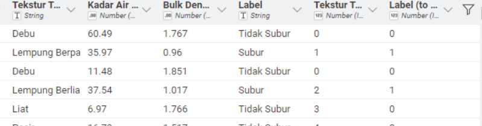
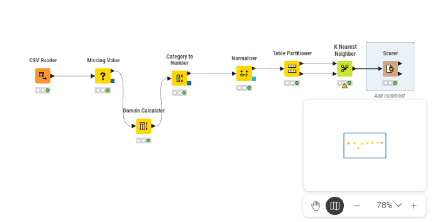

---
jupytext:
  formats: md:myst
  text_representation:
    extension: .md
    format_name: myst
    format_version: 0.13
    jupytext_version: 1.11.5
kernelspec:
  display_name: Python 3
  language: python
  name: python3
---

# UTS-Analisis Data Kesuburan Tanah menggunakan KNN
## Dataset
Dataset berisi 2.000 sampel data tanah dengan 10 fitur agronomis dan 1 kolom label yang membagi kondisi tanah menjadi dua kelas: Subur dan Tidak Subur. Data mengandung missing values (data hilang)
[Datasest Kesuburan Tanah](https://docs.google.com/spreadsheets/d/1_VTOGjavAI1Axd4gFRhXrIKRVVjY9zvM/edit?gid=1558601676#gid=1558601676)
### Atribut

| Atribut | Tipe data | Keterangan |
| :--- | :----: | ---: |
| Ph Tanah | Numerik | Skala pH (0–14) |
| N total | Numerik | Kandungan nitrogen dalam % |
| P Tersedia | Numerik | Kandungan fosfor |
| K Tersedia | Numerik | Kandungan Kalium dalam Tanah |
| C Organik | Numerik | Kandungan karbon organik tanah |
| KTK | Numerik | Kapasitas Tukar Kation |
| Kejenuhan Basa | Numerik | Persentasi kation Basa |
| Tekstur Tanah | Categorical| Komposisi partikel tanah |
| Kadar Air | Numerik | Persentasi kadar air |
| Bulk Density | Numerik | kerapatan Tanah |

## Transformasi
### Data Numerik
Sebelum menghitung jarak, Data harus dinormalisasikan agar data tetap seimbang dan skalanya tidak terlalu jauh, Untuk itu saya menggunakan Normalisasi MIn-Max

$$ v' = \frac{v - \min_A}{\max_A - \min_A} (\text{new_max}_A - \text{new_min}_A) + \text{new_min}_A $$

Keterangan:  
- $v$: Nilai asli dari data.
- $v'$: Nilai baru setelah dinormalisasi.
- $\min_A$: Nilai minimum dari atribut $A$ pada data asli.
- $\max_A$: Nilai maksimum dari atribut $A$ pada data asli.
- $\text{new_min}_A$: Batas bawah dari rentang skala baru yang diinginkan (seringkali $0$).
- $\text{new_max}_A$: Batas atas dari rentang skala baru yang diinginkan (seringkali $1$).

### Data Kategorikal
Sama halnya seperti data numerik harus transformasi kan menjadi numerik ataupun biner, kali ini ada 2 attribut katergorikal tekstur dan juga label, saya mnggunakan Node One to Many untuk mendapatkan nilai numeriknya

 

## Implementasi K-NIME
Untuk melakukan Preoses analisa Data Kesuburan tanah saya menggunakan Software K-NIME

### Workflow

 

 Gambar diatas merupakan gambaran alur kerj atau workflow yg saya gunakan

| Node | Kegunaan | Hasil |
| :--- | :----: | ---: |
| CSV Reader | Membaca file dataet denga  tipe CSV | Data Raw |
| Missing Value | Mengidentifikasi dan mengimputasi misssing value pada data mentah | Dataset bersih tanpa missing value |
| Category to Number | Melakukan Transformasi pada data tipe kategorikal  | Data kategorikal berubah menjadi numerik atau biner |
| Noermalize | Penerapan Min-Max Normalizer| Data menjadi skala yg seragam |
| Partitioning | Membagi data menjadi data training dna testing dengan perbandingan 80:20 | Membagi jadi 2 data |
| KNN | Menghitung jarak dengan 5 Class | Tabel Prediksi |
| Scorer | Mengevaluasi hasil prediksi model | Matrik evaluasi dan confusion matrix |

### Scoring

