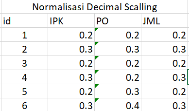

---
jupytext:
  formats: md:myst
  text_representation:
    extension: .md
    format_name: myst
    format_version: 0.13
    jupytext_version: 1.11.5
kernelspec:
  display_name: Python 3
  language: python
  name: python3
---

# Decimal Scalling

Cara sederhana untuk memperkecil nilai mutlak dari sebuah atribut numerik adalah dengan menormalisasi nilai-nilainya melalui pergeseran titik desimal menggunakan pembagian pangkat sepuluh, sedemikian rupa sehingga nilai mutlak maksimumnya selalu kurang dari 1 setelah transformasi. Transformasi ini umumnya dikenal sebagai penskalaan desimal (decimal scaling) [15] dan dinyatakan sebagai:

$$v' = \frac{v}{10^j}$$

Keterangan:
- $v'$: Nilai baru setelah dinormalisasi.
- $v$: Nilai asli dari data.
- $j$: Bilangan bulat (integer) terkecil sedemikian rupa sehingga nilai mutlak maksimum dari $v'$ kurang dari 1 ($\max(|v'|) < 1$).

Implementasi di excel:
 

Implementasi di Python:
```{code-cell} 
import pandas as pd
import numpy as np

data = {
    'id': [1, 2, 3, 4, 5, 6],
    'IPK': [2, 3, 2, 3, 2, 3],
    'PO': [200000, 300000, 200000, 200000, 300000, 400000],
    'JML': [2, 3, 2, 3, 2, 3]
}
df = pd.DataFrame(data)
cols_to_normalize = ['IPK', 'PO', 'JML']

for col in cols_to_normalize:

    max_abs_val = df[col].abs().max()

    if max_abs_val != 0:
        j = len(str(int(max_abs_val)))
    else:
        j = 1 # Jaga-jaga jika semua datanya bernilai 0
    df[f'Dec_{col}'] = df[col] / (10**j)
print(df)
```