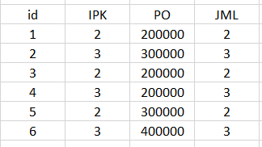
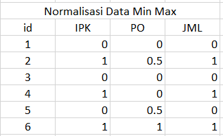

---
jupytext:
  formats: md:myst
  text_representation:
    extension: .md
    format_name: myst
    format_version: 0.13
    jupytext_version: 1.11.5
kernelspec:
  display_name: Python 3
  language: python
  name: python3
---

# MinMax
Normalisasi min-max bertujuan untuk menskalakan semua nilai numerik $v$ dari sebuah atribut numerik $A$ ke rentang tertentu yang dilambangkan dengan $[\text{new_min}_A, \text{new_max}_A]$. Dengan demikian, nilai yang ditransformasi diperoleh dengan menerapkan persamaan berikut pada $v$ untuk mendapatkan nilai baru $v':

$$ v' = \frac{v - \min_A}{\max_A - \min_A} (\text{new_max}_A - \text{new_min}_A) + \text{new_min}_A $$

Keterangan: <br>
- $v$: Nilai asli dari data.
- $v'$: Nilai baru setelah dinormalisasi.
- $\min_A$: Nilai minimum dari atribut $A$ pada data asli.
- $\max_A$: Nilai maksimum dari atribut $A$ pada data asli.
- $\text{new_min}_A$: Batas bawah dari rentang skala baru yang diinginkan (seringkali $0$).
- $\text{new_max}_A$: Batas atas dari rentang skala baru yang diinginkan (seringkali $1$).

Untuk melakukan perhitungan kita membutuhkan data, jadi saya sudah mempersiapkan untuk data yg akan dihitung:

 

 Setelah dilakukan perhitungan menggunakan rumus diatas menggunakan excel didapatkan:

 

Dan tidak lupa melakukan implementasi menggunakan python:
```{code-cell} 
import pandas as pd

data = {
    'id': [1, 2, 3, 4, 5, 6],
    'IPK': [2, 3, 2, 3, 2, 3],
    'PO': [200000, 300000, 200000, 200000, 300000, 400000],
    'JML': [2, 3, 2, 3, 2, 3]
}
df = pd.DataFrame(data)
cols_to_normalize = ['IPK', 'PO', 'JML']

for col in cols_to_normalize:
    min_val = df[col].min() # Mencari nilai minimum
    max_val = df[col].max() # Mencari nilai maksimum
    
    # Menerapkan rumus: v' = (v - min) / (max - min)
    # Kami menaruh hasilnya di kolom baru dengan awalan 'Norm_'
    df[f'Norm_{col}'] = (df[col] - min_val) / (max_val - min_val)
print(df)
```
dengan versi yg berbeda yaitu menggunakan sklearn:
```{code-cell} 
import pandas as pd
from sklearn.preprocessing import MinMaxScaler

df = pd.DataFrame({
    'id': [1, 2, 3, 4, 5, 6],
    'IPK': [2, 3, 2, 3, 2, 3],
    'PO': [200000, 300000, 200000, 200000, 300000, 400000],
    'JML': [2, 3, 2, 3, 2, 3]
})

df[['IPK', 'PO', 'JML']] = MinMaxScaler().fit_transform(df[['IPK', 'PO', 'JML']])

print(df)
```

di mana $\max_A$ dan $\min_A$ masing-masing adalah nilai atribut maksimum dan minimum yang asli.Dalam literatur, "normalisasi" biasanya mengacu pada kasus khusus dari normalisasi min-max di mana interval akhirnya adalah [0,1], yaitu $\text{new_min}_A = 0$ dan $\text{new_max}_A = 1$. Interval [-1,1] juga merupakan rentang yang umum digunakan saat menormalisasi data.Jenis normalisasi ini sangat umum ditemui pada himpunan data (data sets) yang dipersiapkan untuk digunakan dengan metode pembelajaran berbasis jarak (distance-based learning methods). Menggunakan normalisasi untuk menskalakan ulang semua data ke rentang nilai yang sama akan mencegah atribut yang memiliki selisih $\max_A - \min_A$ yang besar mendominasi atribut lain dalam perhitungan jarak. Jika tidak dinormalisasi, hal ini dapat menyesatkan proses pembelajaran karena algoritma akan memberikan bobot kepentingan yang lebih besar pada atribut dengan skala yang lebih besar tersebut. 