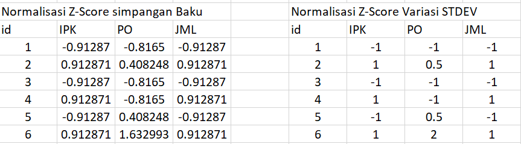

---
jupytext:
  formats: md:myst
  text_representation:
    extension: .md
    format_name: myst
    format_version: 0.13
    jupytext_version: 1.11.5
kernelspec:
  display_name: Python 3
  language: python
  name: python3
---

# Z-Score

Dalam beberapa kasus, normalisasi min-max tidak berguna atau tidak dapat diterapkan. Ketika nilai minimum atau maksimum dari atribut $A$ tidak diketahui, normalisasi min-max menjadi tidak mungkin dilakukan. Bahkan ketika nilai minimum dan maksimumnya tersedia, keberadaan pencilan (outliers) dapat membiaskan normalisasi min-max. Hal ini terjadi karena pencilan akan membuat nilai-nilai data yang normal berkerumun di satu area sempit, sehingga membatasi presisi digital yang tersedia untuk merepresentasikan nilai-nilai tersebut.Jika $\mu_A$ (teks asli menuliskan $A$, namun umumnya menggunakan simbol $\mu$ atau $\bar{x}$ untuk rata-rata) adalah nilai rata-rata dari atribut $A$ dan $\sigma_A$ adalah simpangan baku (standard deviation), nilai asli $v$ dari atribut $A$ dinormalisasi menjadi $v'$ menggunakan.

$$v' = \frac{v - \mu_A}{\sigma_A}$$

Keterangan:
- $v'$: Nilai baru setelah distandardisasi.
- $v$: Nilai asli dari data.
- $\mu_A$: Nilai rata-rata (mean) dari seluruh data pada atribut $A$.
- $\sigma_A$: Simpangan baku (standard deviation) dari seluruh data pada atribut $A$.

Dengan menerapkan transformasi ini, nilai-nilai atribut sekarang memiliki rata-rata (mean) sama dengan $0$ dan simpangan baku (standard deviation) sama dengan $1$.Jika rata-rata dan simpangan baku yang terkait dengan distribusi probabilitas tidak tersedia, biasanya digunakan rata-rata sampel (sample mean) dan simpangan baku sampel (sample standard deviation) sebagai gantinya:

$$\bar{x} = \frac{1}{n} \sum_{i=1}^{n} x_i$$

Keterangan:
- $A$: Adalah nilai rata-rata dari atribut tersebut.
- $\frac{1}{n}$: Membagi total hasil penjumlahan dengan jumlah data ($n$).
- $\sum_{i=1}^{n}$: Ini adalah simbol Sigma yang berarti "jumlahkan semua nilai". Dimulai dari data pertama ($i=1$) sampai data terakhir (sebanyak $n$).
- $v_i$: Adalah nilai dari masing-masing data.

Dan 

$$\sigma_A = \sqrt{\frac{1}{n} \sum_{i=1}^{n} (v_i - \bar{A})^2}$$

Keterangan:
- $\sigma_A$: Simpangan baku (standard deviation) populasi dari atribut $A$.
- $n$: Jumlah total observasi/data dalam populasi.
- $\sum$: Sigma, yang berarti "jumlahkan semua nilai berikut".
- $v_i$: Nilai ke-$i$ dari atribut $A$ (misalnya, $v_1$ adalah data pertama, $v_2$ data kedua, dst.).
- $\bar{A}$ (atau $\mu_A$): Nilai rata-rata (mean) populasi dari atribut $A$.

Sebuah variasi dari normalisasi z-score, yang dijelaskan dalam [15], menggunakan simpangan mutlak rata-rata (mean absolute deviation) $s_A$ dari atribut $A$ sebagai pengganti simpangan baku (standard deviation). Ini dihitung sebagai:

$$s_A = \frac{1}{n} \sum_{i=1}^{n} |v_i - \bar{A}|$$


Sebagai hasilnya, normalisasi z-score sekarang menjadi:

$$v' = \frac{v - A}{s_A}$$

Sebuah keuntungan dari simpangan mutlak rata-rata (mean absolute deviation) $s_A$ adalah bahwa ia lebih tangguh (robust) terhadap pencilan (outliers) dibandingkan dengan simpangan baku $\sigma_A$, karena penyimpangan dari nilai rata-rata yang dihitung dengan $|v_i - A|$ tidak dikuadratkan.

Langsung kita coba hitung dengan excel menggunakan data yg sama dan didapatkan perhitungan sebagai berikut:



Dari gambar diatas terdapat 2 hasil, yg pertama didapat menggunakan rumus AVERAGE/STDEV dan yg kiri menggunakan AVERAGE/EVEDEV. Keduanya merupakan metode Z-Score namun yg membedakan ialah penggunaan Z-Score dengan simpangan baku bisa diterapkan jika hanya ingin melakukan distribusi normal dan nilai pada data tidak lompat terlalu jauh, sedangkan pada Z-Score variasi ditrapkan diakrenakan adanya angka ekstrem atau outlier pada dataset yg bertujuan untuk menjaga konsistensi data. lalu berikutnya pengimplementasiaan menggunakan python:


```{code-cell} 
import pandas as pd

data = {
    'id': [1, 2, 3, 4, 5, 6],
    'IPK': [2, 3, 2, 3, 2, 3],
    'PO': [200000, 300000, 200000, 200000, 300000, 400000],
    'JML': [2, 3, 2, 3, 2, 3]
}
df = pd.DataFrame(data)

kolom_target = ['IPK', 'PO', 'JML']

df_stdev = df.copy()

for col in kolom_target:
    rata_rata = df[col].mean()
    simpangan_baku_sampel = df[col].std(ddof=1) 
    df_stdev[col] = (df[col] - rata_rata) / simpangan_baku_sampel

df_mad = df.copy()

for col in kolom_target:
    rata_rata = df[col].mean()
    simpangan_mutlak = (df[col] - rata_rata).abs().mean()
    
    df_mad[col] = (df[col] - rata_rata) / simpangan_mutlak
print("TABEL KIRI: Normalisasi Z-Score Simpangan Baku")
print(df_stdev[['id', 'IPK', 'PO', 'JML']].round(6).to_string(index=False))

print("\nTABEL KANAN: Normalisasi Z-Score Variasi MAD")
print(df_mad[['id', 'IPK', 'PO', 'JML']].round(1).to_string(index=False))
```

```{code-cell}
import pandas as pd

# 1. Menyiapkan data
data = {
    'id': [1, 2, 3, 4, 5, 6],
    'IPK': [2, 3, 2, 3, 2, 3],
    'PO': [200000, 300000, 200000, 200000, 300000, 400000],
    'JML': [2, 3, 2, 3, 2, 3]
}
df = pd.DataFrame(data)

# Kolom yang akan dinormalisasi
kolom_target = ['IPK', 'PO', 'JML']

# Membuat salinan data agar data asli tidak tertimpa
df_variasi = df.copy()

# 2. Proses Normalisasi Variasi MAD
for col in kolom_target:
    # Langkah A: Menghitung Rata-rata (Mean / AVERAGE)
    rata_rata = df[col].mean()
    
    simpangan_mutlak = (df[col] - rata_rata).abs().mean()
    
    df_variasi[col] = (df[col] - rata_rata) / simpangan_mutlak

# Menampilkan hasil dengan pembulatan 1 angka di belakang koma
print("Hasil Normalisasi Z-Score Variasi (MAD / AVEDEV):")
print(df_variasi[['id', 'IPK', 'PO', 'JML']].round(1).to_string(index=False))
```