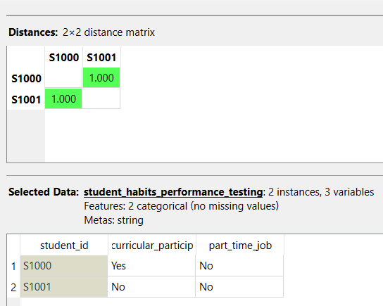

---
jupytext:
  formats: md:myst
  text_representation:
    extension: .md
    format_name: myst
    format_version: 0.13
    jupytext_version: 1.11.5
kernelspec:
  display_name: Python 3
  language: python
  name: python3
---

# Binary
Atribut Binary <br>
Atribut binary adalah atribut yang hanya memiliki dua kemungkinan nilai,ciri-ciri atribut Binary:
- Hanya Memiliki 2 Nilai
- dikodekan 1 atau 0
- Tidak memiliki nilai tengah

$$Distance = |X_{S1000} - X_{S1001}| + |Y_{S1000} - Y_{S1001}|$$ 



```{code-cell} 
import pandas as pd
import numpy as np
df = pd.read_csv("../student_habits_performance.csv")
df.head(5)
```

```{code-cell} 
import pandas as pd
from sklearn.metrics import pairwise_distances

# 1. Menyiapkan Data sesuai gambar
data = {
    'student_id': ['S1000', 'S1001'],
    'curricular_particip': ['Yes', 'No'],
    'part_time_job': ['No', 'No']
}

# Menjadikan student_id sebagai index
df = pd.DataFrame(data).set_index('student_id')

print("Selected Data: student_habits_performance_testing")
print(df)
print("\n")

# 2. Mengubah nilai biner (Yes/No) menjadi angka (1/0)
df_numeric = df.replace({'Yes': 1, 'No': 0})

# 3. Menghitung jarak (menggunakan manhattan distance untuk menghitung selisih)
dist_matrix = pairwise_distances(df_numeric, metric='manhattan')

# 4. Membuat DataFrame untuk Matriks Jarak
df_dist = pd.DataFrame(dist_matrix, index=df.index, columns=df.index)

# Mengatur format tampilan Pandas agar menjadi 3 angka di belakang koma (1.000)
pd.options.display.float_format = '{:.3f}'.format

print("Distances: 2x2 distance matrix")
print(df_dist)
```
