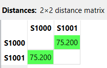
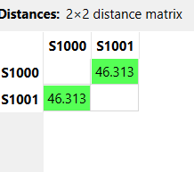

---
jupytext:
  formats: md:myst
  text_representation:
    extension: .md
    format_name: myst
    format_version: 0.13
    jupytext_version: 1.11.5
kernelspec:
  display_name: Python 3
  language: python
  name: python3
---
# Numerik

Atribut Numerik <br>
Atribut Numerik adalah tipe data kategorikal yang:
- Tidak memiliki urutan / ranking
- Hanya berfungsi sebagai label atau nama kategori
- Tidak bisa dibandingkan lebih besar / lebih kecil

```{code-cell} 
import pandas as pd
import numpy as np
df = pd.read_csv("../student_habits_performance.csv")
df.head(5)
```

Untuk dataset diakses sebagai berikut:[Kaggle Student Habits Dataset](https://www.kaggle.com/code/jayaantanaath/student-habits-vs-academic-performance-ml-90/notebook). Untuk dataset diatas memiliki 1000 data dengan 9 fitur atau attribute


```{code-cell} 
df_numeric = df.select_dtypes(include=[np.number])
print(df_numeric.dtypes)
```

Dari data diatas diketahui ada 3 kolom yg merupakan Atribut Numerik, lalu untuk perhitungan numerik umunya menggunakan 2 cara Manhattan dan Ecludian distance

## Manhattan
Manhattan Distance adalah metode untuk mengukur jarak antara dua objek dengan cara menjumlahkan selisih absolut tiap atribut, Disebut Manhattan karena seperti menghitung jarak di kota grid seperti Manhattan — tidak diagonal, tapi lurus kanan/kiri dan atas/bawah.

$$ d(\mathbf{x}, \mathbf{y}) = \sum_{i=1}^{n} |x_i - y_i| $$ 


```{code-cell} 
import pandas as pd
import numpy as np

df = pd.read_csv("../student_habits_performance.csv")

s1000 = df[df['student_id'] == 'S1000']
s1001 = df[df['student_id'] == 'S1001']


numeric_cols = df.select_dtypes(include=['int64','float64']).columns
categorical_cols = df.select_dtypes(include=['object', 'string']).columns

categorical_cols = categorical_cols.drop('student_id')

num_diff = np.abs(
    s1000[numeric_cols].values - 
    s1001[numeric_cols].values
)

numeric_distance = np.sum(num_diff)
cat_diff = (
    s1000[categorical_cols].values != 
    s1001[categorical_cols].values
)

categorical_distance = np.sum(cat_diff)
total_distance = numeric_distance + categorical_distance

print("Numeric distance:", numeric_distance)
print("Categorical distance:", categorical_distance)
print("Total Manhattan (Mixed):", total_distance)
```
Berikut implementasi pada Orange data mining <br>


## Ecludian
Euclidean Distance adalah jarak garis lurus antara dua titik dalam ruang multidimensi.
Secara geometris, ini adalah jarak diagonal langsung dari satu titik ke titik lain.

$$ d(\mathbf{p}, \mathbf{q}) = \sqrt{\sum_{i=1}^{n} (p_i - q_i)^2} $$ 

```{code-cell} 
import pandas as pd
import numpy as np
from sklearn.metrics import pairwise_distances

# Load dataset
df = pd.read_csv("../student_habits_performance.csv")

# Ambil kolom numerik saja
numeric_cols = df.select_dtypes(include=['int64','float64']).columns

# Ambil S1000 & S1001
x = df[df['student_id']=='S1000'][numeric_cols]
y = df[df['student_id']=='S1001'][numeric_cols]

# Hitung Euclidean
distance = pairwise_distances(x, y, metric='euclidean')

print("Euclidean Distance (Raw):", distance[0][0])
```
Berikut implementasi pada Orange data mining:<br>
