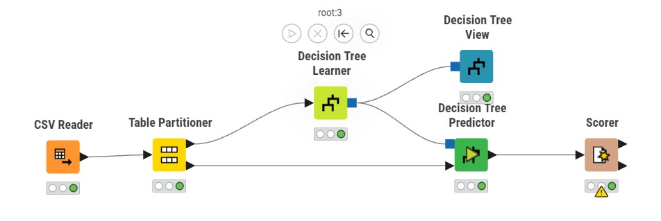
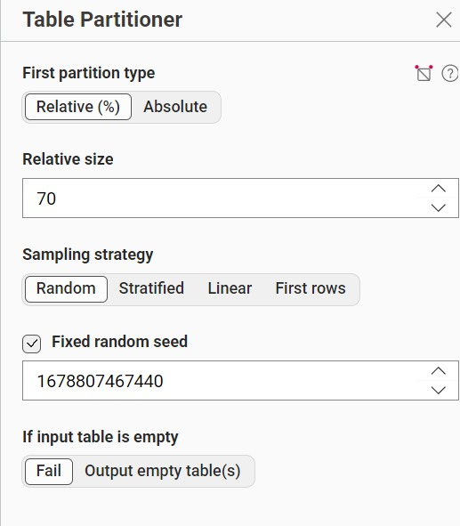
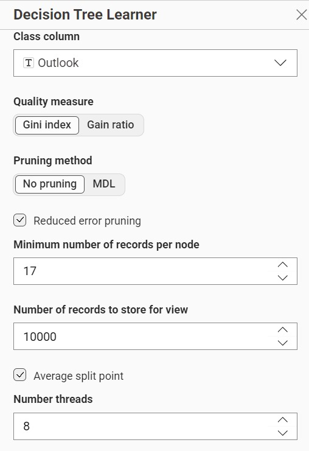
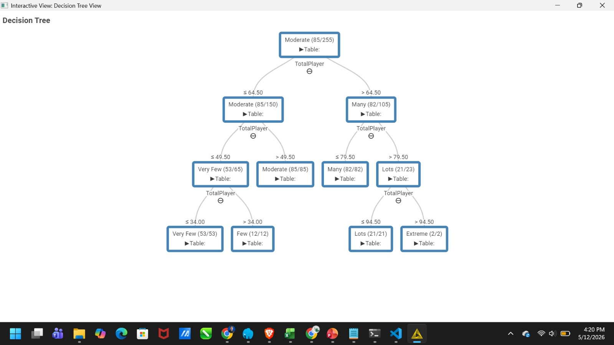

---
jupytext:
  formats: md:myst
  text_representation:
    extension: .md
    format_name: myst
    format_version: 0.13
    jupytext_version: 1.11.5
kernelspec:
  display_name: Python 3
  language: python
  name: python3
---

# Decision Tree
## Pengertian
Algoritme pembelajaran yang diawasi dan bersifat non-parametrik, yang digunakan untuk tugas klasifikasi dan regresi. Memiliki struktur pohon hierarkis, yang terdiri dari simpul akar, cabang, simpul internal dan simpul daun.
## Dataset 
Dataset kali ini saya menggunakan Golf Play Dataset Extended. Golf Play Dataset merupakan dataset yang kategorikal, maka pada preprocessing tidak dilakukan normalisasi maupun encoding karena algoritma Decision Tree dapat langsung menangani data kategorikal tanpa perlu diubah ke format numerik.

| Atribut | Tipe Data | Keterangan |
| :--- | :----: | ---: |
| Date | Numerik | Tanggal observasi |
| SunshineDuration | Numerik | Durasi sinar matahari (jam) |
| Outlook | Kategorikal | Kondisi cuaca (sunny, overcast, rainy) |
| Temperature | Numerik | Suhu udara (°C) |
| Temperature_binned | Kategorikal | Kategori suhu (Cool, Moderate, Warm, Hot) |
| Humidity | Numerik | Kelembaban udara (%) |
| Humidity_binned | Kategorikal | Kategori kelembaban (Dry, Moderate, Humid, Very Humid) |
| WindDirection | Numerik | Arah angin (derajat) |
| WindSpeed | Numerik | Kecepatan angin (m/s) |
| WindSpeed_binned | Kategorikal | Kategori kecepatan angin (No Wind, Very Light Air, dst.) |
| Pressure | Numerik | Tekanan udara (hPa) |
| TotalPlayer | Numerik | Jumlah pemain golf |
| TotalPlayer_binned | Kategorikal | Kategori jumlah pemain (Very Few, Few, Moderate, Many, Lots, Extreme) |
| TimePerRound | Numerik | Waktu per putaran (menit) |
| TimePerRound_binned | Kategorikal | Kategori waktu per putaran (Very Fast, Fast, Moderate, Slightly Slow, Slow, Very Slow) |

## Implementasi KNIME
workflow ini dirancang untuk menggunakan tools knime dengan menggunakan bantuan Node Decision Tree Prediction

### Partisi
Saya melakukan untuk data training dan data tester dengan presentasi 70:30 sebagai berikut:

### Decision Tree Laner atau DTL
Pada Node DTL diperlukan column class saya menggunakan outlook sebagai class

### Hitung 
## Perhitungan 
# Perhitungan Gain Ratio — Dataset Golf Play (Target: Outlook)

**Total data:** $N = 365$

**Kelas Outlook:** sunny = 147, overcast = 129, rainy = 89

---

## Entropy Total (Outlook)

$$
H(S) = -\sum_{i} p_i \log_2 p_i
$$

$$
H(S) = -\left(\frac{147}{365}\log_2\frac{147}{365} + \frac{129}{365}\log_2\frac{129}{365} + \frac{89}{365}\log_2\frac{89}{365}\right)
$$

$$
H(S) = -(0.4027 \times (-1.3134) + 0.3534 \times (-1.5006) + 0.2438 \times (-2.0356))
$$

$$
\boxed{H(S) = 1.5552}
$$

---

## 1. Temperature\_binned

**Nilai:** Warm (112), Hot (100), Moderate (121), Cool (32)

### Entropy tiap nilai:

$$
H(\text{Warm}) = -\left(\frac{52}{112}\log_2\frac{52}{112} + \frac{51}{112}\log_2\frac{51}{112} + \frac{9}{112}\log_2\frac{9}{112}\right) = 1.3230
$$

$$
H(\text{Hot}) = -\left(\frac{93}{100}\log_2\frac{93}{100} + \frac{5}{100}\log_2\frac{5}{100} + \frac{2}{100}\log_2\frac{2}{100}\right) = 0.4263
$$

$$
H(\text{Moderate}) = -\left(\frac{71}{121}\log_2\frac{71}{121} + \frac{47}{121}\log_2\frac{47}{121} + \frac{3}{121}\log_2\frac{3}{121}\right) = 1.1135
$$

$$
H(\text{Cool}) = -\left(\frac{31}{32}\log_2\frac{31}{32} + \frac{1}{32}\log_2\frac{1}{32}\right) = 0.2006
$$

### Weighted Entropy:

$$
H(S, \text{Temperature\_binned}) = \frac{112}{365}(1.3230) + \frac{100}{365}(0.4263) + \frac{121}{365}(1.1135) + \frac{32}{365}(0.2006) = 0.9095
$$

### Info Gain:

$$
IG(\text{Temperature\_binned}) = H(S) - H(S,A) = 1.5552 - 0.9095 = 0.6457
$$

### Split Info:

$$
SI(\text{Temperature\_binned}) = -\left(\frac{112}{365}\log_2\frac{112}{365} + \frac{100}{365}\log_2\frac{100}{365} + \frac{121}{365}\log_2\frac{121}{365} + \frac{32}{365}\log_2\frac{32}{365}\right) = 1.8707
$$

### Gain Ratio:

$$
GR(\text{Temperature\_binned}) = \frac{IG}{SI} = \frac{0.6457}{1.8707} = \boxed{0.3452}
$$

---

## 2. Humidity\_binned

**Nilai:** Humid (122), Moderate (145), Dry (20), Very Humid (78)

### Entropy tiap nilai:

$$
H(\text{Humid}) = -\left(\frac{51}{122}\log_2\frac{51}{122} + \frac{44}{122}\log_2\frac{44}{122} + \frac{27}{122}\log_2\frac{27}{122}\right) = 1.5382
$$

$$
H(\text{Moderate}) = -\left(\frac{85}{145}\log_2\frac{85}{145} + \frac{55}{145}\log_2\frac{55}{145} + \frac{5}{145}\log_2\frac{5}{145}\right) = 1.1497
$$

$$
H(\text{Dry}) = -\left(\frac{13}{20}\log_2\frac{13}{20} + \frac{7}{20}\log_2\frac{7}{20}\right) = 0.9341
$$

$$
H(\text{Very Humid}) = -\left(\frac{57}{78}\log_2\frac{57}{78} + \frac{16}{78}\log_2\frac{16}{78} + \frac{5}{78}\log_2\frac{5}{78}\right) = 1.0536
$$

### Weighted Entropy:

$$
H(S, \text{Humidity\_binned}) = \frac{122}{365}(1.5382) + \frac{145}{365}(1.1497) + \frac{20}{365}(0.9341) + \frac{78}{365}(1.0536) = 1.2472
$$

### Info Gain:

$$
IG(\text{Humidity\_binned}) = 1.5552 - 1.2472 = 0.3080
$$

### Split Info:

$$
SI(\text{Humidity\_binned}) = -\left(\frac{122}{365}\log_2\frac{122}{365} + \frac{145}{365}\log_2\frac{145}{365} + \frac{20}{365}\log_2\frac{20}{365} + \frac{78}{365}\log_2\frac{78}{365}\right) = 1.7629
$$

### Gain Ratio:

$$
GR(\text{Humidity\_binned}) = \frac{0.3080}{1.7629} = \boxed{0.1747}
$$

---

## 3. WindSpeed\_binned

**Nilai:** Very Light Air (115), No Wind (39), Light Air (102), Mild Breeze (28), Moderate Breeze (15), Gentle Air (52), Strong Breeze (6), Near Gale (3), Gale (1)

### Entropy tiap nilai:

$$
H(\text{Very Light Air}) = -\left(\frac{43}{115}\log_2\frac{43}{115} + \frac{37}{115}\log_2\frac{37}{115} + \frac{35}{115}\log_2\frac{35}{115}\right) = 1.5794
$$

$$
H(\text{No Wind}) = -\left(\frac{15}{39}\log_2\frac{15}{39} + \frac{13}{39}\log_2\frac{13}{39} + \frac{11}{39}\log_2\frac{11}{39}\right) = 1.5735
$$

$$
H(\text{Light Air}) = -\left(\frac{41}{102}\log_2\frac{41}{102} + \frac{36}{102}\log_2\frac{36}{102} + \frac{25}{102}\log_2\frac{25}{102}\right) = 1.5560
$$

$$
H(\text{Mild Breeze}) = -\left(\frac{11}{28}\log_2\frac{11}{28} + \frac{11}{28}\log_2\frac{11}{28} + \frac{6}{28}\log_2\frac{6}{28}\right) = 1.5353
$$

$$
H(\text{Moderate Breeze}) = -\left(\frac{7}{15}\log_2\frac{7}{15} + \frac{6}{15}\log_2\frac{6}{15} + \frac{2}{15}\log_2\frac{2}{15}\right) = 1.4295
$$

$$
H(\text{Gentle Air}) = -\left(\frac{26}{52}\log_2\frac{26}{52} + \frac{19}{52}\log_2\frac{19}{52} + \frac{7}{52}\log_2\frac{7}{52}\right) = 1.4202
$$

$$
H(\text{Strong Breeze}) = -\left(\frac{3}{6}\log_2\frac{3}{6} + \frac{2}{6}\log_2\frac{2}{6} + \frac{1}{6}\log_2\frac{1}{6}\right) = 1.4591
$$

$$
H(\text{Near Gale}) = -\left(\frac{2}{3}\log_2\frac{2}{3} + \frac{1}{3}\log_2\frac{1}{3}\right) = 0.9183
$$

$$
H(\text{Gale}) = 0.0000
$$

### Weighted Entropy:

$$
H(S, \text{WindSpeed\_binned}) = \frac{115}{365}(1.5794) + \frac{39}{365}(1.5735) + \frac{102}{365}(1.5560) + \frac{28}{365}(1.5353)
$$

$$
+ \frac{15}{365}(1.4295) + \frac{52}{365}(1.4202) + \frac{6}{365}(1.4591) + \frac{3}{365}(0.9183) + \frac{1}{365}(0.0000) = 1.5110
$$

### Info Gain:

$$
IG(\text{WindSpeed\_binned}) = 1.5552 - 1.5110 = 0.0442
$$

### Split Info:

$$
SI(\text{WindSpeed\_binned}) = -\left(\frac{115}{365}\log_2\frac{115}{365} + \frac{39}{365}\log_2\frac{39}{365} + \cdots + \frac{1}{365}\log_2\frac{1}{365}\right) = 2.4353
$$

### Gain Ratio:

$$
GR(\text{WindSpeed\_binned}) = \frac{0.0442}{2.4353} = \boxed{0.0182}
$$

---

## 4. TotalPlayer\_binned

**Nilai:** Very Few (85), Many (111), Moderate (118), Lots (32), Few (16), Extreme (3)

### Entropy tiap nilai:

$$
H(\text{Very Few}) = -\left(\frac{85}{85}\log_2\frac{85}{85}\right) = 0.0000
$$

$$
H(\text{Many}) = -\left(\frac{76}{111}\log_2\frac{76}{111} + \frac{35}{111}\log_2\frac{35}{111}\right) = 0.8992
$$

$$
H(\text{Moderate}) = -\left(\frac{82}{118}\log_2\frac{82}{118} + \frac{36}{118}\log_2\frac{36}{118}\right) = 0.8874
$$

$$
H(\text{Lots}) = -\left(\frac{29}{32}\log_2\frac{29}{32} + \frac{3}{32}\log_2\frac{3}{32}\right) = 0.4489
$$

$$
H(\text{Few}) = -\left(\frac{9}{16}\log_2\frac{9}{16} + \frac{4}{16}\log_2\frac{4}{16} + \frac{3}{16}\log_2\frac{3}{16}\right) = 1.4197
$$

$$
H(\text{Extreme}) = -\left(\frac{3}{3}\log_2\frac{3}{3}\right) = 0.0000
$$

### Weighted Entropy:

$$
H(S, \text{TotalPlayer\_binned}) = \frac{85}{365}(0.0000) + \frac{111}{365}(0.8992) + \frac{118}{365}(0.8874) + \frac{32}{365}(0.4489) + \frac{16}{365}(1.4197) + \frac{3}{365}(0.0000) = 0.6619
$$

### Info Gain:

$$
IG(\text{TotalPlayer\_binned}) = 1.5552 - 0.6619 = 0.8933
$$

### Split Info:

$$
SI(\text{TotalPlayer\_binned}) = -\left(\frac{85}{365}\log_2\frac{85}{365} + \frac{111}{365}\log_2\frac{111}{365} + \frac{118}{365}\log_2\frac{118}{365} + \frac{32}{365}\log_2\frac{32}{365} + \frac{16}{365}\log_2\frac{16}{365} + \frac{3}{365}\log_2\frac{3}{365}\right) = 2.1011
$$

### Gain Ratio:

$$
GR(\text{TotalPlayer\_binned}) = \frac{0.8933}{2.1011} = \boxed{0.4251}
$$

---

## 5. TimePerRound\_binned

**Nilai:** Fast (65), Slow (87), Moderate (90), Slightly Slow (86), Very Slow (26), Very Fast (11)

### Entropy tiap nilai:

$$
H(\text{Fast}) = -\left(\frac{29}{65}\log_2\frac{29}{65} + \frac{20}{65}\log_2\frac{20}{65} + \frac{16}{65}\log_2\frac{16}{65}\right) = 1.5405
$$

$$
H(\text{Slow}) = -\left(\frac{46}{87}\log_2\frac{46}{87} + \frac{24}{87}\log_2\frac{24}{87} + \frac{17}{87}\log_2\frac{17}{87}\right) = 1.4589
$$

$$
H(\text{Moderate}) = -\left(\frac{41}{90}\log_2\frac{41}{90} + \frac{26}{90}\log_2\frac{26}{90} + \frac{23}{90}\log_2\frac{23}{90}\right) = 1.5373
$$

$$
H(\text{Slightly Slow}) = -\left(\frac{38}{86}\log_2\frac{38}{86} + \frac{26}{86}\log_2\frac{26}{86} + \frac{22}{86}\log_2\frac{22}{86}\right) = 1.5456
$$

$$
H(\text{Very Slow}) = -\left(\frac{16}{26}\log_2\frac{16}{26} + \frac{7}{26}\log_2\frac{7}{26} + \frac{3}{26}\log_2\frac{3}{26}\right) = 1.3002
$$

$$
H(\text{Very Fast}) = -\left(\frac{6}{11}\log_2\frac{6}{11} + \frac{4}{11}\log_2\frac{4}{11} + \frac{1}{11}\log_2\frac{1}{11}\right) = 1.3222
$$

### Weighted Entropy:

$$
H(S, \text{TimePerRound\_binned}) = \frac{65}{365}(1.5405) + \frac{87}{365}(1.4589) + \frac{90}{365}(1.5373) + \frac{86}{365}(1.5456) + \frac{26}{365}(1.3002) + \frac{11}{365}(1.3222) = 1.4978
$$

### Info Gain:

$$
IG(\text{TimePerRound\_binned}) = 1.5552 - 1.4978 = 0.0574
$$

### Split Info:

$$
SI(\text{TimePerRound\_binned}) = -\left(\frac{65}{365}\log_2\frac{65}{365} + \frac{87}{365}\log_2\frac{87}{365} + \frac{90}{365}\log_2\frac{90}{365} + \frac{86}{365}\log_2\frac{86}{365} + \frac{26}{365}\log_2\frac{26}{365} + \frac{11}{365}\log_2\frac{11}{365}\right) = 2.3496
$$

### Gain Ratio:

$$
GR(\text{TimePerRound\_binned}) = \frac{0.0574}{2.3496} = \boxed{0.0244}
$$

---

## Rekapitulasi Gain Ratio

| Fitur | Info Gain | Split Info | Gain Ratio |
|:---|:---:|:---:|:---:|
| Temperature\_binned | 0.6457 | 1.8707 | 0.3452 |
| Humidity\_binned | 0.3080 | 1.7629 | 0.1747 |
| WindSpeed\_binned | 0.0442 | 2.4353 | 0.0182 |
| **TotalPlayer\_binned** | **0.8933** | **2.1011** | **0.4251** |
| TimePerRound\_binned | 0.0574 | 2.3496 | 0.0244 |

**Root node terpilih: TotalPlayer\_binned** dengan Gain Ratio tertinggi $= 0.4251$
## Tree
Berikut Hasil dari Tree:

## Result