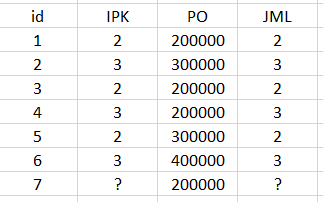

---
jupytext:
  formats: md:myst
  text_representation:
    extension: .md
    format_name: myst
    format_version: 0.13
    jupytext_version: 1.11.5
kernelspec:
  display_name: Python 3
  language: python
  name: python3
---

# Weighted K-Nearest Neighbour Imputation(WKNNI)

WKNNI adalah algoritma machine learning berbasis perhitungan jarak yang digunakan untuk tugas klasifikasi, regresi, atau imputasi data (mengisi data yang hilang). Algoritma ini memprediksi nilai dari sebuah data baru dengan cara mengevaluasi sejumlah $K$ data latih yang memiliki karakteristik paling mirip (tetangga terdekat).Perbedaan utama WKNN dengan algoritma KNN konvensional terletak pada konsep pembobotan (weighting), lalu ada I yg mengacu ke imputasi atau pengisian data kosong.

## Studi Kasus 

 

Pada kali ini saya memiliki data yg memiliki missing values pada kolom IPK dan Jumlah, untuk memberikan value pada missing value saya menggunakan  WKNNI, Berikut langkah-langkahnya:

1. Menghitung jarak kuadrat 
Untuk menghitung jarak kuadrat menggunakan rumus ini:

$$1/s_i = \sum_{h_i \in O_i \cap O_j} (y_{ih} - y_{jh})^2$$

Keterangan:
- $1/s_i$: Kebalikan dari nilai kemiripan (identik dengan jarak).
- $y_{ih}$: Nilai atribut PO pada data target (selalu 200000).
- $y_{jh}$: Nilai atribut PO pada data tetangga ke-$j$.
- $\sum_{h_i \in O_i \cap O_j}$: Penjumlahan ini hanya dilakukan pada atribut yang sama-sama ada isinya

```{figure} image/jarak_kuadrat.PNG
---
width: 20%
align: center
---
Jarak Kuadrat
```

jarak Kuadrat ini didapatkan dari nilai atribut dari target dikurangi dengan nilai atribut data tetangga lalu dikuadratkan sesuai rumus diatas, setelah didapatkan dari nilai jaraknya hitung nilai kemiripan dengan memindah ruas rumus menjadi bentuk seperti ini:

$$s_i = \frac{1}{\sum (y_{ih} - y_{jh})^2}$$

```{figure} image/kemiripan.PNG
---
width: 20%
align: center
---
Kemiripan
```

2. Menentukan K-tertangga terdekat

Saya akan menggunakan K=3, jadi dipilih 3 baris dengan nilai kemiripan paling besar

3. Menghitung Imputasi
Rumus kedua digunakan untuk menghitung nilai akhir yang akan diisi ke bagian yang kosong:

$$y_{\hat{i}h} = \frac{\sum_{j \in I_{Kih}} s_i(y_j)y_{jh}}{\sum_{j \in I_{Kih}} s_i(y_j)}$$

Keterangan:
- $y_{\hat{i}h}$: Nilai prediksi yang kita cari (IPK atau JML untuk baris 7).
- $s_i(y_j)$: Nilai kemiripan (bobot) dari tetangga ke-$j$ (angka 10000 yang kita dapat tadi).
- $y_{jh}$: Nilai asli IPK/JML dari tetangga ke-$j$.
- Bagian atas pembagian adalah total (bobot $\times$ nilai), sedangkan bagian bawah adalah total bobot.

```{figure} image/hasil_hitung.PNG
---
width: 30%
align: center
---
Imputasi
```
Sebelum jumlah akhir kita cari tahu untuk pembilang dan penyebutnya terlebih dahulu dan didapatkan hasil diatas.

## Hasil Akhir

```{figure} image/hasil_akhir.PNG
---
width: 50%
align: center
---
Hasil Akhir
```

Hasil dari IPK:

$$y_{\text{IPK}} = \frac{(s_1 \cdot \text{IPK}_1) + (s_3 \cdot \text{IPK}_3) + (s_4 \cdot \text{IPK}_4)}{s_1 + s_3 + s_4}$$

$$y_{\text{IPK}} = \frac{(10000 \cdot 2) + (10000 \cdot 2) + (10000 \cdot 3)}{10000 + 10000 + 10000}$$

$$y_{\text{IPK}} = \frac{20000 + 20000 + 30000}{30000}$$

$$y_{\text{IPK}} = \frac{70000}{30000} = \mathbf{2.33}$$


Hasil dari JML:

$$y_{\text{JML}} = \frac{(s_1 \cdot \text{JML}_1) + (s_3 \cdot \text{JML}_3) + (s_4 \cdot \text{JML}_4)}{s_1 + s_3 + s_4}$$

$$y_{\text{JML}} = \frac{(10000 \cdot 2) + (10000 \cdot 2) + (10000 \cdot 3)}{10000 + 10000 + 10000}$$

$$y_{\text{JML}} = \frac{20000 + 20000 + 30000}{30000}$$

$$y_{\text{JML}} = \frac{70000}{30000} = \mathbf{2.33}$$


